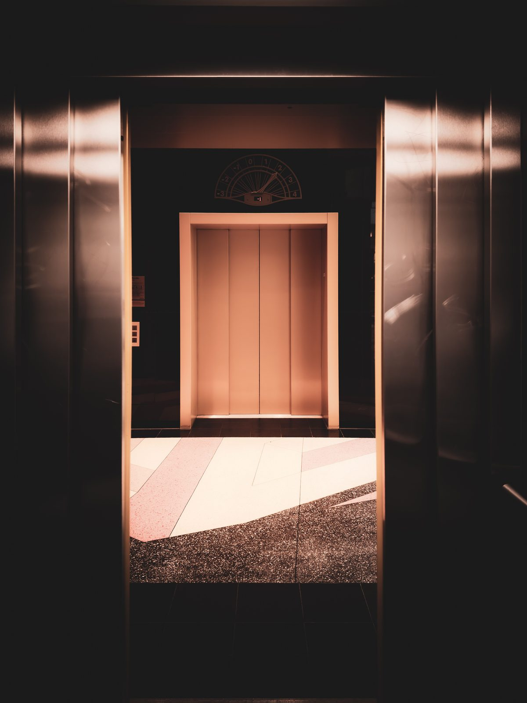

{/* _class: impact */}

# Power Dynamics of the Elevator

## SLOP2950 · Week 3

---

{/* _class: quote */}

> All of it is settled in the first two seconds, silently, by people who have
> never discussed it and never will.

---

## The elevator as a closed system

A lift car is one of the few public spaces where nobody can leave until it
decides to let them.

- **fixed capacity** — a hard ceiling on how many people share the space
- **fixed exits** — one door, opening on its own schedule
- **short duration** — whatever the etiquette is, it only has to hold for a
  minute or two
- **high density** — strangers closer together than almost any other public
  norm tolerates

That combination is what makes its etiquette so rigid — and so easy to
disrupt with a single small deviation.

---

## What gets contested

- the **panel** as a status object: who operates it
- **door-holding** as a negotiation with no words
- the "**wrong third**" of the car

> The "door close" button, mashed by someone in a hurry, does almost
> nothing in most buildings — accessibility rules require the doors to
> dwell open for several seconds regardless. The gesture is entirely
> symbolic, and almost nobody who does it knows that.

Whether holding the door counts as a favour owed or a favour freely given is
genuinely unsettled — one etiquette line holds that another car is a minute
away and nobody should be made to wait for a straggler; another holds that
basic courtesy costs the whole car a few seconds it will never notice
losing.

```notes
Ask the room who instinctively stands near the panel. Someone always does,
and they rarely notice they've claimed it.
```

---

{/* _class: centered */}

## Bad manner vs. good manner

**Bad manner:** Seeing someone jogging across the lobby toward the car and
holding the close-door button anyway, on the reasoning that they should
have moved faster — leaving them to wait for the next one over a saving of
two or three seconds.

**Good manner:** Holding the door for the few extra seconds it takes that
same person to reach the car — a cost every passenger already inside
shares for a moment, against a cost the latecomer would otherwise carry
alone.


Photo: MART PRODUCTION / Pexels


Photo: Patrice Werner / Pexels

---

## Case studies: single-input disruptions

One small deviation — a beat too long on the door, a step into the wrong
third of the car — and a car full of strangers recalibrates instantly.

---

## References

- Vance, P. (2027). *The Panel as Status Object: Micro-Negotiation in
  Vertical Transit.* Journal of Applied Incivility Studies, 5(1).
- Halvorsen, I. (2021). *Closed Systems, Open Contests: Density and Etiquette
  Rigidity.* Behavioural Urbanism Quarterly, 9(3).
- Reeve, L. (2025). *A Short History of the Door-Close Button.* Proceedings
  of the Symposium on Everyday Infrastructure.

---

## Quiz

**Q1.** Why does holding the close-door button on someone jogging toward the
lift count as deniable, in the course's sense?

*Because it's always possible to claim you simply didn't see them — the act
can be waved off as an accident even when it wasn't one.*

---

**Q2.** A passenger reaches past you to press a floor without asking. Is
this the isolated act, or is it the aftermath?

*The isolated act — the aftermath is however the car reacts to it next.*
