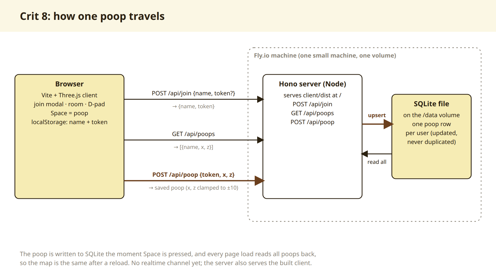
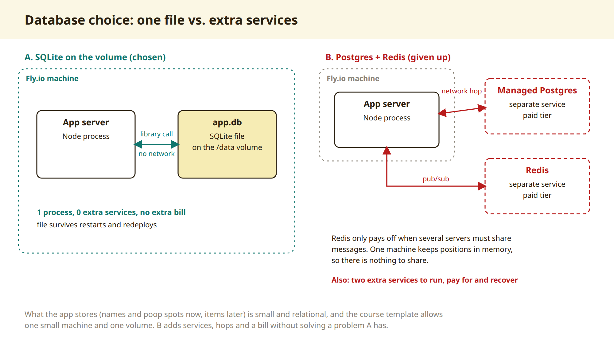

# Process overview

## Crit 8: proof of life

My final project idea is a real-time 3D social space, something like a tiny
VRChat or Gather.town. That's far too much for one week, so for crit 8 I cut it
down to a single interaction that doesn't need real-time at all: pick a name,
leave one poop in a toilet, come back and find it with your name over it.

I started a few hours before the cutoff, and that shaped everything below.

## How I worked with the agent

**I wrote the plan first, by hand.** Before any code, I wrote a plan in Korean:
the concept, the one thing a stranger does, the trace they find on return,
what's out of scope, and the rules I wanted the agent to follow. The agent
reviewed it and pushed back on a few gaps I hadn't thought about: what happens
to the trace if poops expire after 24 hours, how someone recognises their own
poop if two people pick the same name, and what a stranger is allowed to type
into a public room. I made those calls myself (no expiry for now, unique names,
letters and underscores up to 8, one poop per person that moves when you poop
again) and they went straight into `CLAUDE.md` and the spec.

**Contract first, then two sessions in parallel.** With so little time, I ran
two Claude Code sessions. One built the server, database, tests and deploy; the
other built the Three.js client and found a CC0 toilet model. The server
session wrote the API contract (join, list poops, place poop) first and sent it
to the client session, so the client was built against a mock and neither side
waited. Only one session was allowed to commit, so the history stays readable.
The client session also did the browser QA: keyboard-only, a phone viewport
with real touch events, the duplicate-name case, and a reload to check the trace.

**A correction I made.** The agent ran the spec against the live site to check
the deploy, which left three random test poops in the production database for
my pod to find. Nothing broke, but random names in a room meant for people
are noise. The spec now runs locally, and any testing on the live site goes
through one named QA visitor that's reused, so it leaves one poop, not dozens.

**Translation, not ghostwriting of the ideas.** I wrote my README in Korean and
had the agent translate it. The arguments and sources are mine; the agent's job
was clean English.

## Why this stack

- **3D in the browser (WebGL, Three.js).** A 3D world is the most original and
  eye-catching way into the idea. I weighed Three.js against Babylon.js and
  went with Three.js because there are far more examples to learn from, and I
  only pay for the parts I import.
- **SQLite on the Fly volume.** I need to store names and where each poop is.
  SQLite is one file and one library, no separate database server, and it fits
  Fly's free setup of one machine and one volume. Node 24's built-in
  `node:sqlite` means there's no native module to compile in Docker.
- **Hono on Node.** One small process serves the client, the API and this
  README, rendered on the server.
- **Later: real-time.** Positions and chat will go over WebSockets. In crit 9
  I'll weigh Colyseus (room-based state sync, less server code) against plain
  `ws`.

### What I ruled out

- **Postgres + Redis.** Managed versions on Fly cost money, and I want to stay
  inside the course credit. Extra processes on one machine worried me, and with
  a single server there's nothing for Redis to cache.
- **A NoSQL database.** It needs its own server process, which doesn't fit one
  machine and one volume.

## History

- [`4a0838b`](https://github.com/comp4020-agentic-coding-studio/comp4020-final-passionleader/commit/4a0838b): server, database and spec tests for names and one poop per visitor.
- [`11de407`](https://github.com/comp4020-agentic-coding-studio/comp4020-final-passionleader/commit/11de407): `CLAUDE.md` rules.
- [`a0ff52f`](https://github.com/comp4020-agentic-coding-studio/comp4020-final-passionleader/commit/a0ff52f): the 3D client (toilet room, join modal, movement, one poop, name labels, phone controls).
- [`49f9442`](https://github.com/comp4020-agentic-coding-studio/comp4020-final-passionleader/commit/49f9442): poop favicon.
- [`73b3a20`](https://github.com/comp4020-agentic-coding-studio/comp4020-final-passionleader/commit/73b3a20): README (first version of what good means, sources) and this file.
- [`b7ed8eb`](https://github.com/comp4020-agentic-coding-studio/comp4020-final-passionleader/commit/b7ed8eb): the toilet becomes a public bathroom: 10 open stalls with a toilet each, 3 sinks, collision.
- [`12b1c09`](https://github.com/comp4020-agentic-coding-studio/comp4020-final-passionleader/commit/12b1c09): calm looping background music (CC0), a synthesised fart on every poop, and a mute button.
- [`8bd8d7e`](https://github.com/comp4020-agentic-coding-studio/comp4020-final-passionleader/commit/8bd8d7e): fixes from live QA: sinks rebuilt as a vanity counter with a mirror, and phone-specific help text.
- [`2560fa6`](https://github.com/comp4020-agentic-coding-studio/comp4020-final-passionleader/commit/2560fa6): crit 8 reflection.
- [`cb7a46b`](https://github.com/comp4020-agentic-coding-studio/comp4020-final-passionleader/commit/cb7a46b): poop emoji throughout the README.
- [`8a6532b`](https://github.com/comp4020-agentic-coding-studio/comp4020-final-passionleader/commit/8a6532b): fix for poops vanishing: the database now lives on the Fly volume, not the machine's wiped disk.
- [`d00d5c1`](https://github.com/comp4020-agentic-coding-studio/comp4020-final-passionleader/commit/d00d5c1): one poop every 5 seconds, enforced on the server, to keep a mashed key from hammering the database.
- [`6e75cf9`](https://github.com/comp4020-agentic-coding-studio/comp4020-final-passionleader/commit/6e75cf9): four diagrams (architecture, database choice, crit 8 to final, work split) added here and to the reflection.
